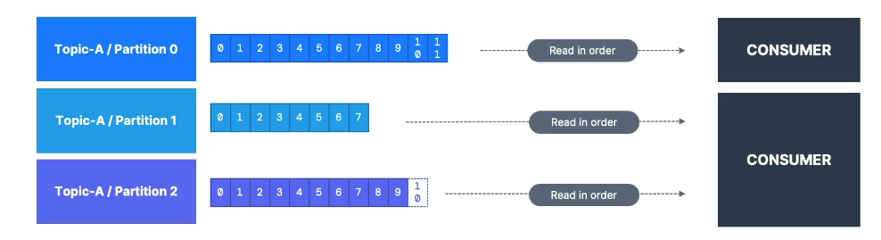
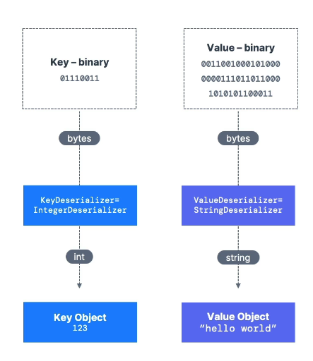

# Consumers

- Consumers read data from a topic (identified by name) - pull model

- Consumers automatically know which broker to read from

- In case of broker failures, consumers know how to recover

- Data is read in order from low to high offset **within each partition**

# Consumer Deserializer

- Deserialize indicates how to transform bytes into objects / data

- They are used on the value and the key of the message

- Common Deserializers
    - String (incl. JSON)
    - Int, Float
    - Avro
    - Protobuf

- The serialization / deserialization type must not change during a topic lifecycle (create a new topic instead)