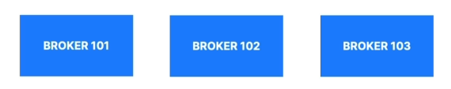
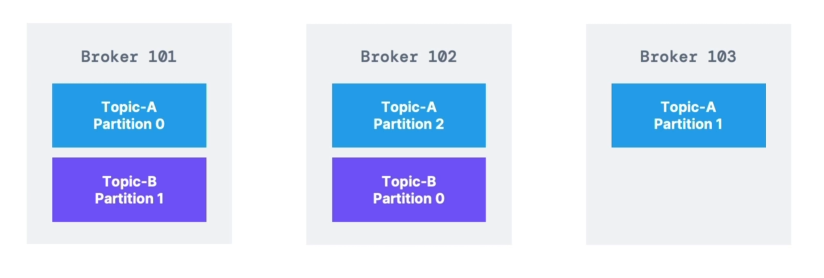

# Kafka Brokers

- A Kafka cluster is composed of multiple brokers (servers)

- Each broker is identified with its ID (integer)

- Each broker contains certain topic partitions

- After connecting to any broker (called a bootstrap broker), you will be connected to the entire cluster (Kafka clients have smart mechanics for that)

- A good number to get started is 3 brokers, but some big clusters have over 100 brokers

- In these examples we choose to number brokers starting at 100 (arbitrary)

# Brokers and topics

- Example of **Topic-A** with **3 partitions** and **Topic-B** with **2 partitions**

- Note: data is distributed, and Broker 103 doesn't have any **Topic B** data

# Kafka Broker Discovery

- Every broker is also called a "bootstrap server"

- That means that **you only need to connect to one broker**, and the Kafka clients will know how to be connected to the entire cluster (smart clients)

- Each broker knows about all brokers, topics and partitions (metadata)

