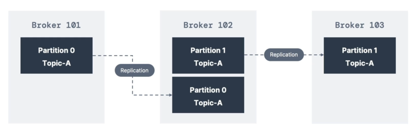
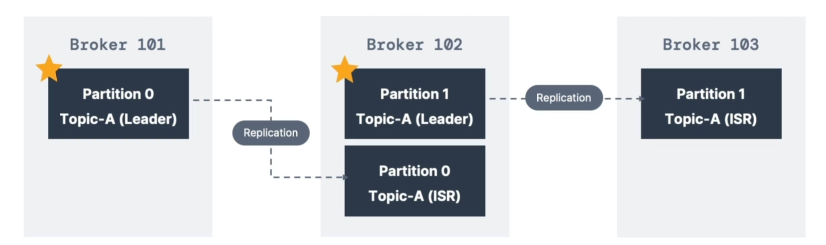
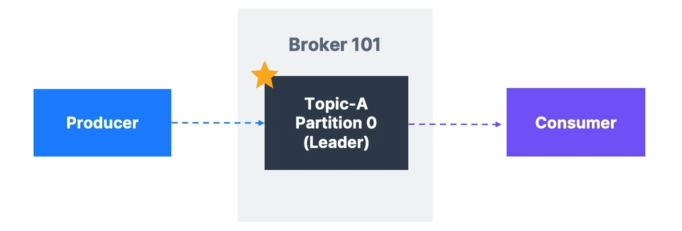
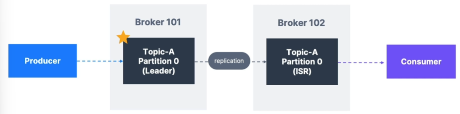

# Topic replication factor

- Topics should have a replication factor > 1 (usually between 2 and 3)

- This way if a broker is down, another broker can serve the data

- Example: Topic-A with 2 partitions and replication factor of 2

- Example: We lose Broker 101

- Result: Broker 101 and 103 can still serve the data, Partition 0 through Broker 101 and Partition 1 through Broker 103.

# Concept of Leadership for a Partition

- At any time only ONE broker can be a leader for a given partition

- Producers can only send data to the broker that is leader of a partition

- The other brokers will replicate the data

- Therefore, each partition has one leader and multiple ISR (in-sync replicas)

# Default producer & consumer behavior with leaders

- **Kafka Producers** can only write to the leader broker for a partition

- **Kafka Consumers** by default will read from the leader broker for a partition

# Kafka Consumers Replica Fetching (Kafka v2.4+)

- Since Kafka 2.4, it is possible to configure consumers to read from the closest replica

- This may help improve latency, and also decrease network costs if using the cloud

