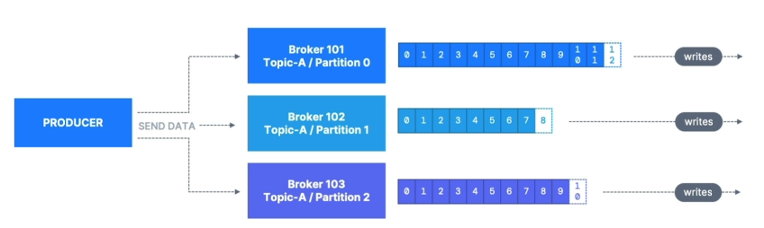

# Producer Acknowledgments (acks)

- Producers can choose to receive acknowledgment of data writes:
    - **acks = 0**: Producer won't wait for acknowledgment (possible data loss)

    - **acks = 1**: Producer will wait for leader acknowledgment (limited data loss)

    - **acks = all**: Leader + replicas acknowledgment (no data loss)

# Kafka Topic Durability

- For a topic replication factor of 3, topic data durability can withstand 2 brokers loss.

- As a rule, for a replication factor of N, you can permanently lose up to N-1 brokers and still recover your data.