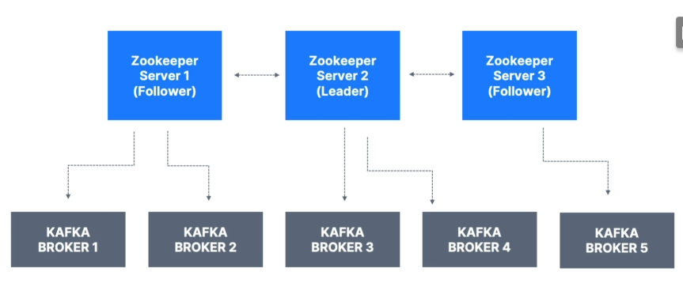

# Zookeper

- Zookeper manages brokers (keeps a list of them)

- Zookeeper helps in performing leader election for partitions

- Zookeper sends notifications to Kafka in case of changes (e.g. new topic, broker dies, broker comes up, delete topics, etc...)

- **Kafka 2.x can't work without Zookeper**

- **Kafka 3.x can work without Zookeper (KIP-500) - using Kafka Raft instead**

- **Kafka 4.x will not have Zookeper**

- Zookeper by design operates with an odd number of servers (1, 3, 5, 7)

- Zookeper has a leader (writes) the rest of the servers are followers (read)

- (Zookeper does NOT store consumer offsets with Kafka > v0.10)

# Zookeper Cluster (ensemble)

# Should you use Zookeper?

- With Kafka Brokers?
    - Yes, until Kafka 4.0 is out while waiting for Kafka without Zookeper to be production-ready

- With Kafka Clients?
    - Over time, the Kafka clientes and CLI have been migrated to leverage the brokers as a connection endpoint instead of Zookeper

    - Since Kafka 0.10, consumer store offset in Kafka and Zookeeper must not connect to Zookeeper as it is deprecated

    - Since Kafka 2.2, the *kafka-topics.sh* CLI command references Kafka brokers and not Zookeeper for topic management (creation, deletion, etc...) and the Zookeeper CLI argument is deprecated.

    - All the APIs and commands that were previously leveraging Zookeeper are migrated to use Kafka instead, so that when clusters are migrated to be without Zookeeper, the change is invisible to clients.

    - Zookeeper is also less secure than Kafka, and therefore Zookeeper ports should only be opened to allow traffic from Kafka brokers, and not Kafka clients.

    - **Therefore, to be a great modern-day Kafka developer, never ever use Zookeeper as a configuration in your Kafka clients, and other programs that connect to Kafka**.