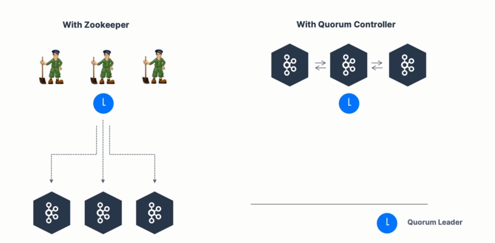
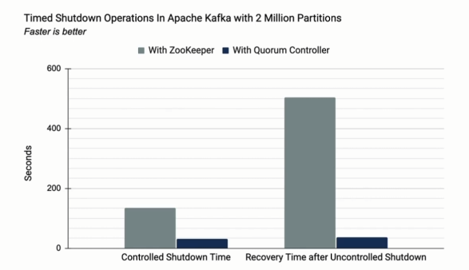

# About Kafka KRaft

- In 2020, the Apache Kafka project started to work **to remove the Zookeeper dependency** from it (KIP-500)

- Zookeeper shows scaling ussues when Kafka clusters have > 100,000 partitions

- By removing Zookeeper, Apache Kafka can
    - Scale to millions of partitions, and becomes easier to maintain and set-up

    - Improve stability, makes it easier to monitor, support and administer

    - Single security model for the whole system

    - Single process to start with Kafka

    - Faster controller shutdown and recovery time

- Kafka 3.x now implements the Raft protocol (KRaft) in order to replace Zookeeper
    - Production ready since Kafka 3.3.1 (KIP-833)
    - Kafka 4.0 will be released only with KRaft (no Zookeeper)

# Kafka KRaft Architecture

# KRaft Performance Improvements

