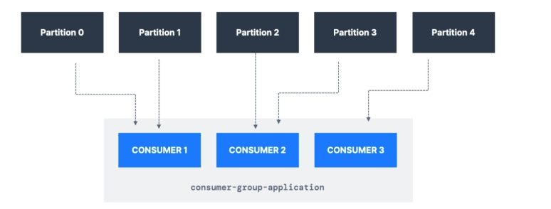
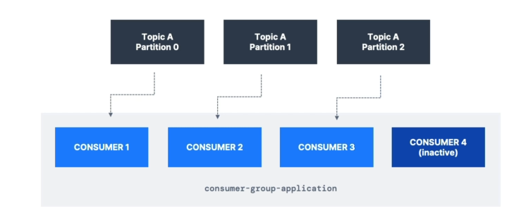
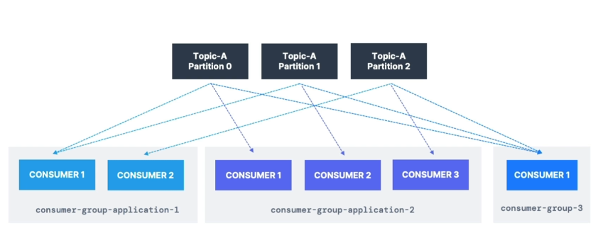

# Consumer Groups

- All the consumers in an application read data as a consumer group

- Each consumer within a group reads from exclusive partitions

# Consumer Groups - What if you have too many consumers?

- If you have more consumers than partitions, some consumers will be inactive

# Multiple Consumers on one topic

- In Apache Kafka it is acceptable to have multiple consumer groups on the same topic

- To create distinct consumer groups, use the consumer property **group.id**

# Consumer Offsets

- Kafka stores the offsets at which a consumer group has been reading

- The offsets committed are in Kafka topic named ***__consumer_offsets***

- When a consumer in a group has processed data received from Kafka, it should be **periodically** committing the offsets (the Kafka broker will write to **__consumer_offsets**, not the group itself)

- If a consumer dies, it will be able to read back from where it left off thanks to the committed consumer offsets!

# Delivery semantics for consumers

- By default, Java Consumers will automatically commit offsets (at least once)

- There are 3 delivery semantics if you choose to commit mannually

- **At least once (usually preferred)**
    - Offsets are commited after the message is processed
    - If the processing goes wrong, the message will be read again
    - This can result in duplicate processing of messages. Make sure your processing is **idempotent** (i.e. processing again the messages won't impact your systems)

- **At most once**
    - Offsets are committed as soon as messages are received
    - If the processing goes wrong, some messages will be lost (they won't be read again)

- **Exactly once**
    - For Kafka -> Kafka workflows: use the Transactional API (easy with Kafka Streams API)

    - For Kafka -> External System workflows: use an **idempotent** consumer