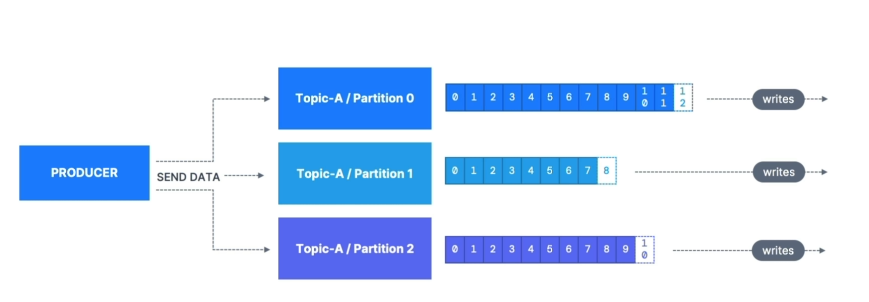
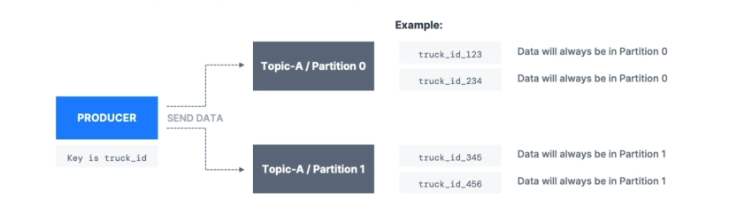
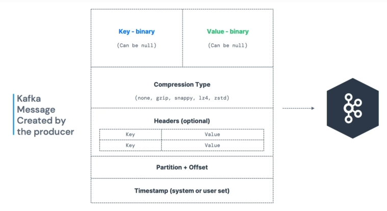
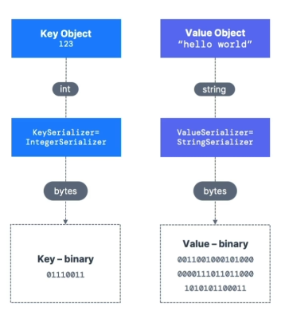

# Producers

- Producers write data to topics (which are made of partitions)

- Producers know to which partition to write to (and which Kafka broker has it)

- In case of Kafka broker failures, Producers will automatically recover

      This load is balanced to many brokers thanks to the number of partitions

# Producers: Message keys

- Producers can choose to send a **key** with the message (string, number, binary, etc...)

- If *key = null*, data is sent round robin (partition 0, then 1, then 2...)

- If *key != null*, then all messages for that key will always go to the same partition (hashing)

- Keys are typically sent if you need message ordering for a specific field (ex: truck_id)

# Kafka Messages anatomy...

# Kafka Message Serializer

- Kafka only accepts bytes as an input from producers and sends bytes out as an output to consumers

- Message Serialization means transforming objects / data into bytes

- They are used on the value and the key

- Common Serializers
    - String (incl. JSON)
    - Int, Float
    - Avro
    - Protobuf

# For the curious: Kafka Message Key Hashing

- A Kafka partitioner is a code logic that takes a record and determines to which partition to send it into.

- **Key Hashing** is the process of determining the mapping of a key to a partition

- In the default Kafka partitioner, the keys are hashed using the **murmur2 algorithm**, with the formula below for the curious:

      targetPartition = Math.abs(Utils.murmur2(keyBytes)) % (numPartitions - 1)