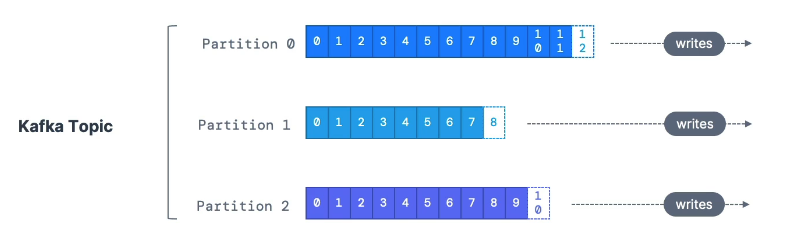
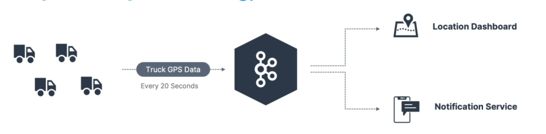

# Kafka TOPICS:

### - Topics: a particular stream of data
within Kafka Cluster. 

    A Kafka Cluster can have many topics for example: logs, purchases, twitter_tweets, trucks_gps.

### - Like a table in a database (without all the constraints)
Because you send whatever you want to a Kafka topic, there's no data verification;

### - You can have as many topics as you want
In your Kafka Cluster.

### - A topic is identified by its name
    for example: logs, purchases, twitter_tweets, trucks_gps.

### Support any kind of message format
And then you can send for example, Json, Avro, text file, binary, whatever you want.

### The sequence of messages is called a data stream
    And this is why Kafka is called a data streaming platform, because you can make data stream through topics.

### You cannot query topics, instead, use Kafka Producers to send data and Kafka Consumers to read the data.

# Partitions and offsets

### - Topics are split in **partitions** (example: 100 partitions)
- Messages whitin each partition are ordered
- Each message within a partition gets an incremental id, called **offset**.

### - Kafka topics are **immutable**: once data is written to a partition, it cannot be changed

# Topic example: truck_gps

- Say you have a fleet of trucks; each truck reports its GPS position to Kafka.

- Each truck will send a message to Kafka every 20 seconds, each message will contain the truck ID and the truck position (latitude and longitude)

- You can have a topic **truck_gps** that contains the position of all trucks.

- We choose to create that topic with 10 partitions (arbitrary number)

# Topics, partitions and offsets - important notes

- Once the data is written to a partition, it cannot be changed (immutability)

- Data is kept only for a limited time (default is one week - configurable)

- Offset only have a meaning for a specific partition.
    - E.g. offset 3 in partition 0 doesn't represent the same data as offset 3 in partition 1
    - Offsets are not re-used even if previous messages have been deleted

- Order is guaranteed only within a partition (not across partitions)

- Data is assigned randomly to a partition unless a key is provided (more on this later)

- You can have as many partitions per topic as you want